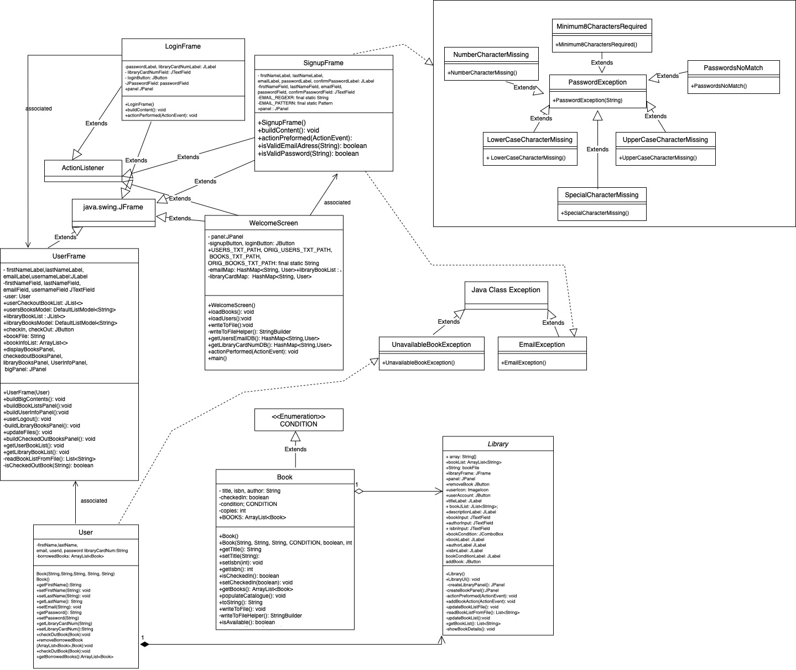

# CS151-Library-Management-System-by-Jamba-Juice

Project title: Library Management System by Jamba Juice
Team #, team members: Jamba Juice; Lisa Yu, Jessica Fung, Nelly Belmont
Team members working on the proposal: Lisa Yu, Jessica Fung, Nelly Belmont

• State the problem/issue to resolve:
The problem is inventory management, we need a system for accurate cataloging, tracking, and organization of books

• If applicable, describe assumptions / operating environments / intended usage
	It is assumed that the library data will be obtained from a file and not hardcoded into the program. Our solution will also store said data and the users who wish to have a library card into a data structure. The operating environment will be a GUI much resembling a search engine, where the user will be able to check the status of books in our database and their own status of checked out books and fees.

• High-level description of your solution which may include (but is not limited to), your plan and approach.  Be as specific as possible.
We will create a library system that allows users to check books in and out of the library, as well as store information about users such as the ordering of books taken out and returned alphabetically, user name, and user’s library card number. With Swing GUI, the user will be able to create an account with the library, thus receiving a library card with a randomized number. Everything will be split into a couple of classes, with Library being the parent class and Books/Users being the child classes. We will also use separate files to store information about the books. With the files, we will be able to sort the books alphabetically.
• Functionality: describe how your solution tackles the issues
Our solution tackles the issues by creating an organized system that will keep track of user activity in the library. On top of that, the system will also organize the list of books available, making a clear and concise interface for users to get books from.
• Operations: List operations for each intended user (in list format).  Be precise and specific.
	User:
Access list of available books
Ability to take out book and return book
Assign library card number to user
	Books:
Status of book: Checked in/ Checked out
Amount of books the library has
Condition of book: new, good, fair, poor

Login:
(Pre-existing user)
- User: 19897
- Password: Password1!

Login into Library database to add/remove books in library (same login page as user):
- User: Librarian
- Password: librarian123!

*UML diagrams are in the Diagrams branch*
Sequence Diagram

Case Diagram

Class Diagram

State Diagram

Welcome Screen

