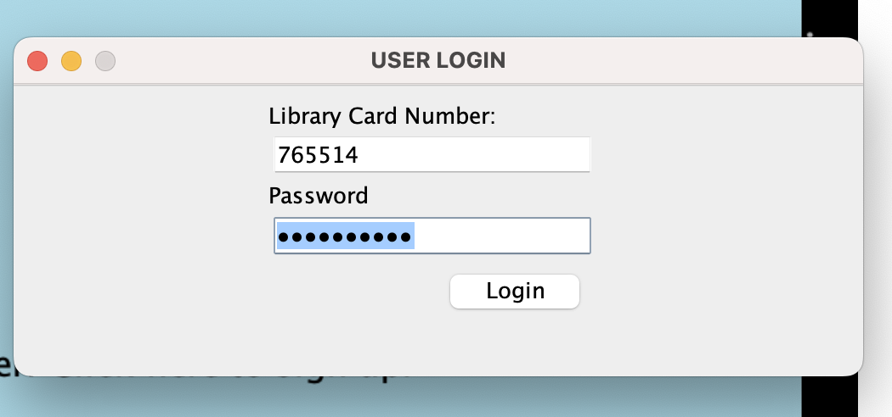

# CS151-Library-Management-System-by-Jamba-Juice

Project title: Library Management System by Jamba Juice
Team #, team members: Jamba Juice; Lisa Yu, Jessica Fung, Nelly Belmont

1. Team members working on the proposal and their contributions in detail:
Lisa -  State the problem/issue to resolve
Jess - High-level description of your solution which may include (but is not limited to), your plan and approach. Be as specific as possible
Nelly -  If applicable, describe assumptions / operating environments / intended usage It is assumed that the library data will be obtained from a file and not hardcoded into the program

2. Team members working on the project presentation and their contributions in detail (You are not to give your teammates "free" points if they didn't work, else the whole team gets a 0).
We all just walked through the presentation together. Everyone got together and practiced going through the application as if we were presenting. We discussed each others parts and established who did what/who is talking about what part of the project. We made sure to talk to one another about which details were most important to present and rehearsed prior to the presentation.

3. Team members working on the project (code) and report. Mention their contributions in detail.
Lisa - Welcome screen UI, User UI for login and sign up page, User UI where they check in and check out books to the library
Did the front end for the welcome screen, signup page, and the user class. Also created the methods to check in and check out books from the library and into the user’s account. Debugged the classes to make sure there are no errors. Helped debug and fix the JUnit tests
Jess - Book text file and Library UI, JUnits
Did the front and back end for the library class, created both the library GUI as well as setting up reader and writers to read and write from the Book text file. Made sure any removed or added books in the library screen gets updated correctly in the text file. Created the JUnit tests to test methods from the Library, User, and Book class
Nelly - User text file, reading and writing files to User
Did the back end for the user class, such as reading and writing books and users from their respective text file (books.txt and users.txt). Made sure the Users class properly implemented the Book class, so implementations worked properly and the books, GUI, and files would be updated correctly. Helped debug and fix the JUnit tests

4. Problem/issue ?
We could barely get github to work, we had to send each other zipfiles back and forth through emails and one person had to copy and paste the other people’s code into their computer. We also struggled on how to implement each person’s code together into one concise and runnable project.

5. If applicable, briefly survey previous works if any (include references)
Lisa used their HW4 as a base for the welcome and sign in page, then changed the code for the library management system.
Nelly used her prior assignments at De Anza to reference for the File I/O requirement
Jessica used their HW 4 as a base for the library screen, as well as HW 5 for the JUnit tests.

6. Diagrams [just the reference - hyperlinks not actual image] (update your diagrams if you have changed your design and previous feedback. Add a sequence diagram if it is missing)

Sequence Diagram

Case Diagram

Class Diagram

State Diagram

7. Functionality: describe how your solution tackles the issues
It creates a user friendly GUI to store the books from the library and the facilitate the transaction of books between the user and the library.
We created a system that stores and processes a fluid list of books to be implemented by the GUI.
Any changes to the list of users or books are stored in the respective text file

8. Operations: List operations for each intended user (in list format).  Be precise and specific.
	User:
Access list of available books
Ability to take out book and return book
Assign library card number to user
	Books:
Status of book: Checked in/ Checked out
Amount of books the library has
Condition of book: new, good, fair, poor

9. Solution (How did you solve the problem)
We solved the GitHub issue by sort of figuring out how to use GitHub, using the resources we were given.
We figured out how to create a repository, as well as commit and push our local code into the remote code.

10. Steps to run your code

HOW TO RUN CODE:
- double click on jar file
(Note: All 4 txts must be in the same directory)

HOW TO RUN JUNIT:
- Compile and run UnitTesting java file

Walkthrough steps descripton:
On welcome screen, click on sign up to make a new account, you will be given a library card number
Login with library card number and password
OR login with a pre-exisitng account:
(Pre-existing user)
- Library Card Number: 19897
- Password: Password1!

EXTRA CREDIT: Login as librarian,

Library Card Number: Librarian

Password: librarian123!

- Library Card Number: Librarian

- Password: librarian123!

Here, you can add a book on the right by entering the 4 fields, title, author, ISBN and condition
You can also remove book by clicking on the book on the left panel, it will also display book info

WAlK THROUGH:

Welcome Screen

Sign Up Screen

Library Card Num

Log In Screen

User Page

Book Info Page

Book Checked Out

Librarian Page

Adding Book as Librarian

Added Book by Librarian

Removed Book by Librarian

